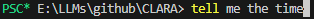
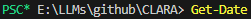
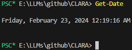

# CLARA (NVIDIA Gen AI on RTX PCs Developer Contest Entry)
**C**ommand **L**ine **A**ssistant with **R**tx **A**cceleration

## overview
CLARA transforms your plain english instructions into actionable CLI commands with the press of one key, all within PowerShell! Clara uses TensorRT-LLM to build an optimized Llama 13b LLM model for efficient inference on NVIDIA GPUs. NVIDIA Ampere cards (30 series GPUs) and better experience significant performance gains during inference when using TensorRT-LLM.

## installation
see the [quickstart](docs/QUICKSTART.md/#installation-using-windowswindows_installerps1-script) for installation steps with an easy-to-use install script. or, if you prefer, there are [manual setup steps](docs/QUICKSTART.md/#manual-setup) instead.

## removal
see the [removal guide](docs/REMOVE_CLARA.md/#removal-guide) for steps on how to disable CLARA.

## how to use
1. after succesfully installing CLARA, press `control+u` together to enable CLARA.
    - when CLARA is successfully activated, you'll see `PS <your_current_folder>> CLARAMode Activated` in PowerShell. press `control+u` together again to deactivate CLARA.
    - note: you'll also notice that when CLARA is enabled, your PowerShell prompt changes from starting with `PS` to starting with a green `PSC*`. this is to indicate that CLARA is enabled and replacing the behavior of your `tab` key.

2. enter a plain english directive that you want PowerShell to perform:
    - steps 1. and 2. will look something like this:
        <div>
            
            
            
        </div>
    - try experimenting with some of these plain english prompts `tab` to see what CLARA generates:

        ```plaintext
        create a new directory in the current directory called Salutations, navigate into it, run git init inside of it
        tell me who the current Windows user is
        tell me all installed commands
        list all processes that start with W
        create a new directory called new_dir, copy call_model.py from current directory into it
        show me my entire command history
        output the contents of README.md in the current directory
        ```

3. when ready, press `tab` so CLARA can generate PowerShell commands for you.

    - note: there will be a bit of a delay while the TRT runs Llama 13b and generates a response to your instruction. see [additional information](#additional-information) for more on this.
    - after 5-10 seconds, you should see a PowerShell-equivalent of your english instruction:

        

3. if you're satisfied with what the model has come up with, hit enter to run your command.

    

4. (optional) when done using CLARA, you can disable it by pressing `control+u` together once more.


## additional information

- "Why is there a 5-10 second delay between my pressing `tab` and receiving valid output?"
    - the delay is not indicative of production performance, as the actual token/s generated on even a consumer card such as a 3080 should be pretty fast. the delay is due to loading the model into VRAM for every inference request.
        - in a true a production environment, something like Triton Inference Server would be leveraged to keep the model loaded in VRAM, which should drastically reduce latency between pressing `tab` and receiving output. 
        - unfortunately, Triton Inference Server does not support offloading (AFAIK at the time of making this repo), and my 3080 was not able to load even Llama 7b entirely into its 10GB of VRAM. hopefully i win this contest so that i can instead use a 4090 to put the entirety of my LLM models in VRAM from now on -- *juuust kidding >:)*.
- "Why did you choose Llama 13b?"
    - this repo uses int8 quantized Llama 13b, as it's the largest model that i could build on a 3080 while maintaining high token/s during inference. TensorRT-LLM will succesfully build Llama13b int8 on cards with 10GB of VRAM or greater, but even quantizing to float16 was too much for my 3080. YMMV depending on how beefy your hardware is.
    - **note:** **if you have less than 10GB of VRAM, you might not have enough VRAM for the TensorRT-LLM build process.**
    - if you still want to use this repo despite having a card with less than 10GB of VRAM, you can try building a quantized Llama 7b model instead of Llama 13b during the build process.
- "Can I use bigger Llama models with CLARA?"
    - CLARA is compatible with all Llama chat models. if you have better hardware than i do (namely, more VRAM) and want to build a TensorRT-LLM model for something as large as Llama 70b, by all means, make it happen!
- "Can I use models that aren't Llama?"
    - as we've recently seen with the Mistral models, smaller models are getting better all the time. with a little bit of elbow grease, you could use CLARA with Mistral 7b (which TensorRT-LLM now supports) and likely get better better output quality than even Llama 13b. 
        - for the sake of compatability, this repo uses Llama 13b by default, but the decision on what LLM to use is yours.

## repo structure

```plaintext
docs/
│   QUICKSTART.md             # installation guide
|   REMOVE_CLARA              # removal guide
powershell_module/
│   autocomplete_handler.psm1 # PowerShell module to add CLARA autocomplete functionality
windows/
│   windows_installer.ps1     # PowerShell script for environment setup on Windows
.gitattributes
.gitignore
call_model.py                 # script to process English directives and call llama 13b via TensorRT-LLM
README.md                     # README for CLARA
```
